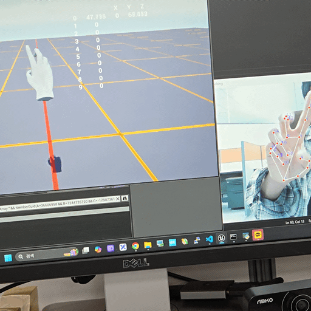
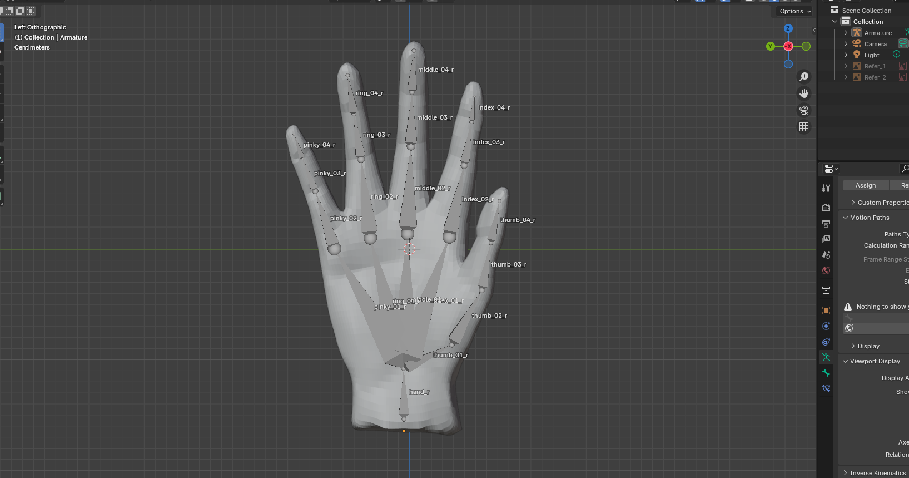

# 실시간 손 추적 & OSC 기반 핸드 리깅

## 📌 언리얼엔진4.27에서 사용 소개


카메라 앞의 손을 MediaPipe로 추적하여 21개의 랜드마크를 뽑고, EMA(지수 이동 평균)로 스무딩(**떨림보정**)한 뒤 OSC로 언리얼 엔진에 전송합니다. 언리얼에서는 수신된 좌표를 이용해 Poseable Mesh 핸드 리그(bones)를 실시간으로 제어하여 가상 손이 실제 손 동작을 1:1로 따라합니다.

---

## 🔍 주요 기능

- **MediaPipe Hands** 기반 21개 랜드마크 추적  
- **Exponential Moving Average (EMA)** 스무딩  
- **python-osc** 으로 OSC 메시지 송신  
- **Unreal Engine** 에서 OSCServer로 데이터 수신  
- **Poseable Mesh Component** 활용, Bone Rotation/Location 제어  

---

## 📦 요구사항

- Python 3.8+  
  - opencv-python  
  - mediapipe  
  - numpy  
  - python-osc  
- Unreal Engine 4.27+ (OSC 플러그인 활성화)  
- USB 웹캠  
- 21개 본으로 리깅된 손 모델(자체 제작)

---

## 🖐 손 모델 21개 본 구조


```
.
└── hand_r
    ├── thumb_01_r
    │   └── thumb_02_r
    │       └── thumb_03_r
    │           └── thumb_04_r
    ├── index_01_r
    │   └── index_02_r
    │       └── index_03_r
    │           └── index_04_r
    ├── middle_01_r
    │   └── middle_02_r
    │       └── middle_03_r
    │           └── middle_04_r
    ├── ring_01_r
    │   └── ring_02_r
    │       └── ring_03_r
    │           └── ring_04_r
    └── pinky_01_r
        └── pinky_02_r
            └── pinky_03_r
                └── pinky_04_r
```

---

## 🚀 설치 & 실행

### 1. Python 가상환경 세팅 및 패키지 설치

```bash
python3.8 -m venv venv
source venv/bin/activate        # Windows: venv\Scripts\activate.bat
pip install opencv-python mediapipe numpy python-osc
```

### 2. Python 스크립트 실행

```bash
cd python
python hand_tracker_v1.py
```

- 실행 시 `Hand Tracking` 창이 뜨고, 현재 웹캠 프레임 위에 랜드마크와 인덱스 번호가 그려집니다.
- `/hand/landmark/0…20` 주소로 `[x,y,z]` 좌표가 OSC로 전송됩니다.

### 3. Unreal 프로젝트 설정

1. **OSC 플러그인** 활성화  
   - Edit → Plugins → “OSC” 검색 → Enable → 에디터 재시작  
        - *OSC (Open Sound Control) 명칭으로 나옵니다*
2. **osc_receiver** 액터 배치
    - 액터 블루프린트 추가
    - Components에 **Poseable Mesh Component** 추가하고 핸드 스켈레톤 할당  
    - Event Graph:  
        - BeginPlay → Create OSCServer (127.0.0.1:8000) ← 파이썬과 엔진이 같은 IP에서 동작할 경우
        - On OSC Message → 주소 파싱 → `Set Array Elem` 으로 `LMArray[21]` 채우기
            - LMArray 벡터 배열에 x,y,z 좌표 데이터를 저장하는 방식  
    - **HandRig Rotation** 매크로 (또는 함수) →  좌표 데이터를 방향으로 계산
        - ForLoop 0→20  
        - ChildPos = LMArray[i], ParentPos = LMArray[parentIdx[i]]  
        - Dir = ChildPos – ParentPos → Rot = MakeRotFromX(Dir)  
        - Set Bone Rotation By Name  

---

## 📁 프로젝트 구조(수정 중)

```
.
├── python/
│   └── hand_tracker_to_unreal.py      # 웹캠 캡처 → MediaPipe → EMA → OSC 송신
└── Unreal/
    ├── Blueprints/
    │   └── osc_receiver.uasset         # OSC 수신 → LMArray 저장 → HandRig 제어
    ├── Meshes/
    │   └── hand_skeleton/              # 핸드 모델 & 리깅
    └── Widget/
        └── Vector_Debug.uasset         # 랜드마크 디버그 UI (선택)
```

---

## 🛠️ 트러블슈팅

- **OSC 포트 불일치**: Python 스크립트와 Unreal OSCServer가 같은 IP/Port(기본 127.0.0.1:8000)를 사용해야 합니다. 만약 같은 PC에서 구동하지 않는다면 방화벽 설정, 포트포워딩을 통한 외부 접근을 허용해야 합니다.
- **랜드마크 떨림**: `SMOOTHING_ALPHA` 값을 조절해 반응속도⇆부드러움 균형을 맞춰야 합니다.  
- **BoneNameArray / ParentIndexArray**: 핸드 스켈레톤에 정확히 매핑되어야 합니다.  
- **Collision**: Poseable Mesh는 충돌체를 직접 제공하지 않으므로, Grab용 Box/Sphere Collision을 추가해야 합니다.
- **MODEL BONE 누락**: 블렌더에서 FBX로 모델을 내보낼때 Add Leaf Bones 체크 & Only Deform Bones를 체크 해제 합니다. 언리얼에서 임포트 과정중 Deform 체크가 되지 않은 본이나 가중치가 0인 본은 필터링됩니다.
- **Bone 가중치 누락**: 완벽한 리깅을 하지 않으면 자동으로 필터링됩니다. 간단하게하고 블렌더에서 본과 손 모델을 선택 후 with automatic weights 옵션으로 가중치를 부여합니다.
- **본과 랜드마크 불일치**: 리깅된 뼈의 개수가 랜드마크와 다르다면 랜드마크 번호와 대응되는 본을 언리얼에서 직접 받아서 처리해야 합니다.

---

## 📜 라이선스

MIT License © 2025

